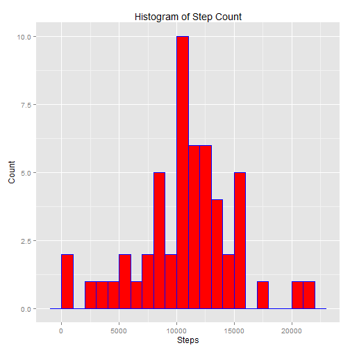
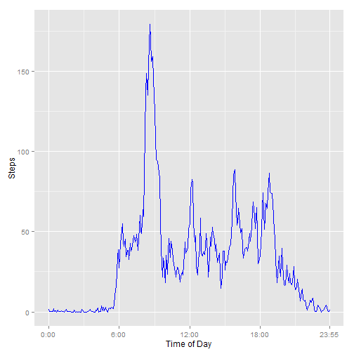
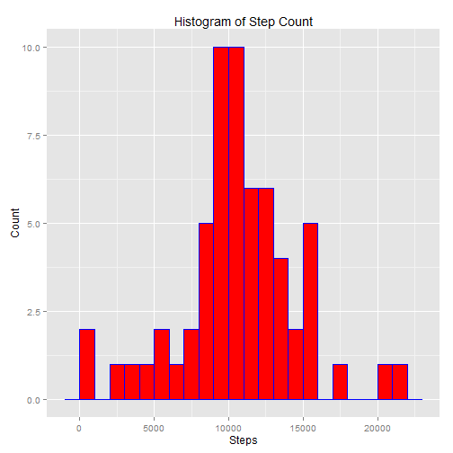
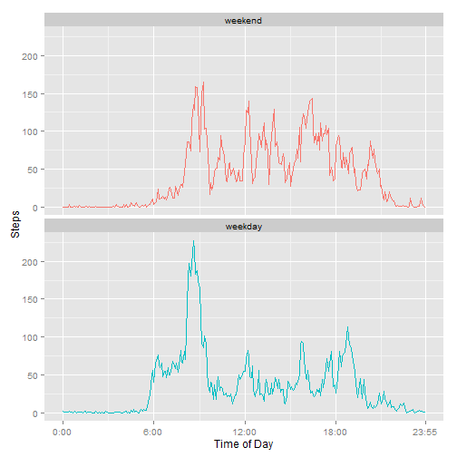

# Reproducible Research - Peer Assessment 1

## Introduction
This document provides answers to some questions regarding file activity.csv, found
[here](https://d396qusza40orc.cloudfront.net/repdata%2Fdata%2Factivity.zip). This file contains
three variables: *steps*, denoting the number of steps taken while wearing an activity
monitoring device; *date*, a string representing the date (this file includes two months
of data, from 10/01/2012 through 11/30/2012), and *interval*, a string representing the
start time of the 5-minute monitoring period (from 0 to 2355), which is in HHMM format.

## Loading and Preprocessing the data
activity.csv is a "clean" file, so it can be read into R for analysis by:

```r
suppressWarnings(suppressMessages(library(dplyr)))
suppressWarnings(suppressMessages(library(ggplot2)))

activity <- read.csv("activity.csv")
```
The data looks like this:

```r
head(activity)
```

```
##   steps       date interval
## 1    NA 2012-10-01        0
## 2    NA 2012-10-01        5
## 3    NA 2012-10-01       10
## 4    NA 2012-10-01       15
## 5    NA 2012-10-01       20
## 6    NA 2012-10-01       25
```
We create a column which combines the date and interval into
a time value, dttm, and another that converts the interval into a cardinal number, 
interval_val, and take another look at our data:

```r
activity$interval_str <- sprintf("%02d:%02d", floor(activity$interval/100), activity$interval %% 100)
activity <- mutate(activity, dttm = as.POSIXct(paste(date, interval_str), format="%Y-%m-%d %H:%M"))
activity <- mutate(activity, interval_val = 60 * floor(interval/100) + interval %% 100)
head(activity)
```

```
##   steps       date interval interval_str                dttm interval_val
## 1    NA 2012-10-01        0        00:00 2012-10-01 00:00:00            0
## 2    NA 2012-10-01        5        00:05 2012-10-01 00:05:00            5
## 3    NA 2012-10-01       10        00:10 2012-10-01 00:10:00           10
## 4    NA 2012-10-01       15        00:15 2012-10-01 00:15:00           15
## 5    NA 2012-10-01       20        00:20 2012-10-01 00:20:00           20
## 6    NA 2012-10-01       25        00:25 2012-10-01 00:25:00           25
```

## What is mean total number of steps each day?
1. Calculate the total number of steps taken per day


```r
activ_sum_steps <- activity %>% group_by(date) %>% summarize(sum(steps))
names(activ_sum_steps)[2] <- "steps"
head(activ_sum_steps)
```

```
## Source: local data frame [6 x 2]
## 
##         date steps
## 1 2012-10-01    NA
## 2 2012-10-02   126
## 3 2012-10-03 11352
## 4 2012-10-04 12116
## 5 2012-10-05 13294
## 6 2012-10-06 15420
```
2. Make a histogram of the total number of steps taken per day


```r
qplot(activ_sum_steps$steps, geom = "histogram", col = I("Blue"), fill = I("Red"), binwidth = 1000, main = "Histogram of Step Count", xlab = "Steps", ylab = "Count", ylim = c(0, 10))
```

 

[Note: the total number of days shown is 53, because there are 8 days for which no
values were read.]

3. Calculate and report the mean and median of the total number of steps per day


```r
mean(activ_sum_steps$steps, na.rm = TRUE)
```

```
## [1] 10766.19
```

```r
median(activ_sum_steps$steps, na.rm = TRUE)
```

```
## [1] 10765
```

[Note: it seems obvious that some days, e.g. 10/2, have missing data, so these numbers may be a bit misleading - we will explore that further below.]

## What is the average daily activity pattern?
1. Make a time series plot of the 5-minute interval and the average number of steps
taken, averaged across all days

Since there are NAs in this data, for purposes of this question, we turn those NAs
into 0.


```r
activity2 <- activity
activity2$steps[is.na(activity2$steps)] <- 0
activ_sum_interval <- activity2 %>% group_by(interval_val) %>% summarize(mean(steps))
names(activ_sum_interval)[2] <- "steps"

t <- ggplot(activ_sum_interval, aes(interval_val, steps)) + geom_line(color = "blue") + xlab("Time of Day") + ylab("Steps") + scale_x_continuous(breaks = c(0, 360, 720, 1080, 1435), labels = c("0:00", "6:00", "12:00", "18:00", "23:55"))
t
```

 

2. Which 5-minute interval, on average across all the days in the dataset, contains
the maximum number of steps?


```r
max_t <- activ_sum_interval$interval_val[which.max(activ_sum_interval$steps)]
sprintf("%02d:%02d", floor(max_t/60), max_t - 60 * floor(max_t/60))
```

```
## [1] "08:35"
```

## Imputing missing values

1. Calculate and report the total number of missing values in the dataset


```r
sum(is.na(activity$steps))
```

```
## [1] 2304
```

2. Devise a strategy for filling in all the missing values in the dataset

We'll use something simple here: we'll fill in NAs with the mean for the 5-minute
interval (using the dataset activ_sum_interval we created in the previous section).

3. Create a new dataset that is equal to the original dataset but with the missing data
filled in.


```r
activity2 <- activity
activity2$steps<-ifelse(is.na(activity2$steps),activ_sum_interval$steps,activity2$steps)
```

4. Make a histogram of the total number of steps taken per day and calculate and
report the **mean** and **median** total number of steps taken per day.


```r
activ_sum_steps <- activity2 %>% group_by(date) %>% summarize(sum(steps))
names(activ_sum_steps)[2] <- "steps"
qplot(activ_sum_steps$steps, geom = "histogram", col = I("Blue"), fill = I("Red"), binwidth = 1000, main = "Histogram of Step Count", xlab = "Steps", ylab = "Count", ylim = c(0, 10))
```

 

```r
mean(activ_sum_steps$steps)
```

```
## [1] 10581.01
```

```r
median(activ_sum_steps$steps)
```

```
## [1] 10395
```

Do these values differ from the estimates from the first part of the assignment? **Clearly there is a small difference (mean: 10766.19 -> 10581.01, median: 10765 -> 10395)**

What is the impact of imputing missing data on the estimates of the total daily
number of steps? **Our particular strategy of using the mean of the interval seemed
to keep the data fairly consistent with the original dataset.**

## Are there differences in activity patterns between weekdays and weekends?

1) Create a new factor variable in the dataset with two levels - "weekday" and "weekend"
indicating whether a given date is a weekday or weekend day.


```r
weekend <- c('Saturday', 'Sunday')
activity2$dayType <- factor((weekdays(activity2$dttm) %in% weekend), levels = c(TRUE, FALSE), labels = c("weekend", "weekday"))
```

2) Make a panel plot containing a time series plot of the 5-minute interval and the
average number of steps taken, averaged across all weekday days or weekend days.


```r
activity2 <- mutate(activity2, interval_val = 60 * floor(interval/100) + interval %% 100)
activ_sum_interval <- activity2 %>% group_by(interval_val, dayType) %>% summarize(mean(steps))
names(activ_sum_interval)[3] <- "steps"

t <- ggplot(activ_sum_interval, aes(interval_val, steps, color = factor(dayType))) + geom_line() + facet_wrap(~dayType, nrow = 2) + xlab("Time of Day") + ylab("Steps") + theme(legend.position = "none") + scale_x_continuous(breaks = c(0, 360, 720, 1080, 1435), labels = c("0:00", "6:00", "12:00", "18:00", "23:55"))
t
```

 
